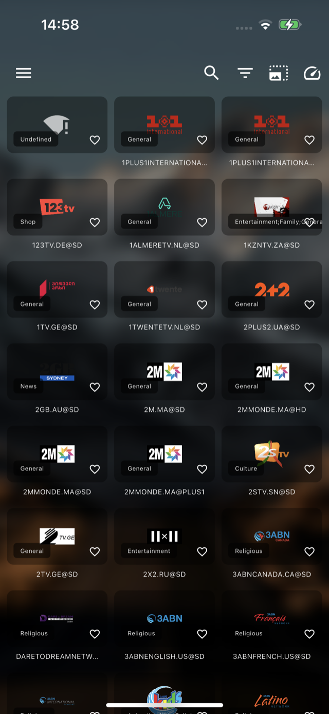
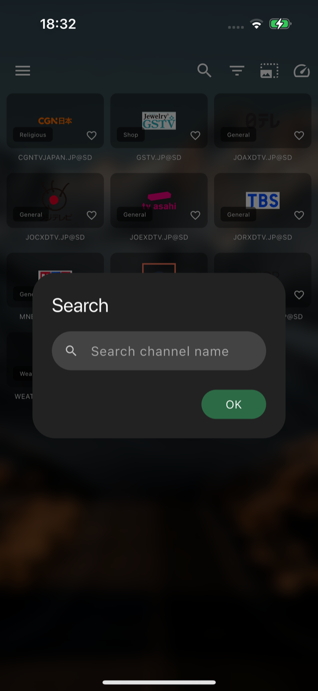
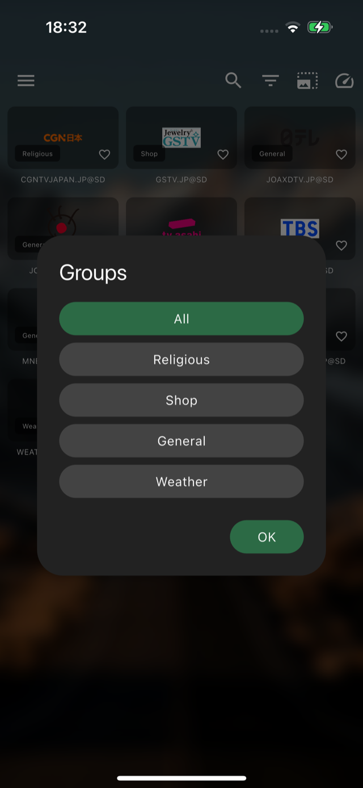
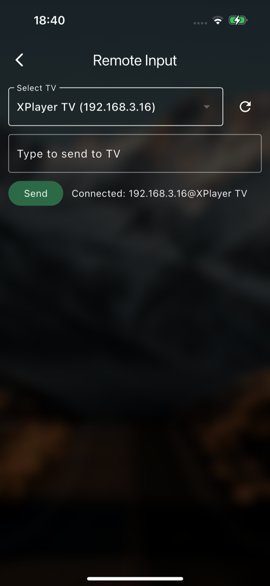

[English](README_EN.md) | **中文**

<h1 align="center">XPlayer</h1>

<p align="center">跨平台 IPTV / M3U 播放器 · Android（含平板/TV）· iOS（含 iPad）· macOS · Windows · Linux</p>

<p align="center">开箱即用，内置 <a href="https://github.com/iptv-org/iptv">iptv-org</a> 公开直播源，支持<b>频道分组、搜索</b>、EPG 节目单、收藏，以及<b>手机遥控 TV 输入</b>。</p>

<p align="center">
  <a href="https://github.com/TNT-Likely/xplayer/releases/latest"></a>
  <a href="https://github.com/TNT-Likely/xplayer/releases"></a>
  <a href="https://github.com/TNT-Likely/xplayer/stargazers"></a>
  <a href="https://github.com/TNT-Likely/xplayer/actions/workflows/release.yml"></a>
  <a href="LICENSE"></a>
</p>

---

## ✨ 特性

- 📺 **开箱即用的直播源**：内置 [iptv-org](https://github.com/iptv-org/iptv) 公开订阅源，首启自动加载「中国」，也可一键添加 全部/港/台/新/美/英/日/韩 + 体育/新闻/电影 等推荐源；同时支持导入任意 M3U/M3U8（本地文件或网络 URL）。
- 🔎 **分组 + 搜索**：频道太多找不到好看的？顶部搜索框按名称即时过滤，分组标签一键筛选 News / Sports / Movies…（世界杯看球更快）。
- 🗓️ **EPG 节目单**：支持 XMLTV 节目单。
- ⭐ **收藏**：常看频道一键收藏。
- 🖥️ **全平台**：Android（手机/平板）、Android TV、iOS / iPad、macOS、Windows、Linux，一套代码。
- 📱 **手机遥控 TV 输入**：TV 端打字麻烦？手机自动发现同一局域网内的 TV，远程输入实时同步（含删除键）。
- 🌐 **多语言**：中文 / English。

## 📸 预览

<p align="center">
  
  
  
  <br/>
  
  
</p>

<details>
<summary><b>🚀 安装</b></summary>

前往 [Releases](https://github.com/TNT-Likely/xplayer/releases) 下载：

- **Android / Android TV / 平板**（已按 CPU 架构拆包，体积更小）：
  - `xplayer-<版本>-arm64-v8a.apk` —— 绝大多数手机 / 平板 / 电视盒子（**推荐**）
  - `xplayer-<版本>-armeabi-v7a.apk` —— 较老的 32 位设备
  - `xplayer-<版本>-x86_64.apk` —— 模拟器 / x86 设备
  - `xplayer-<版本>-universal.apk` —— 不确定架构时的通用兜底包
- **Windows**：`xplayer-windows-x64.zip`
- **macOS**：`xplayer-macos.dmg`（首次打开见常见问题）
- **Linux**：`xplayer-linux-x64.tar.gz`
- **iOS / iPad**：见 Releases 的未签名 ipa，自行签名安装

</details>

<details>
<summary><b>🕹️ 使用</b></summary>

1. 打开 App，首启会自动加载内置的 iptv-org 中国直播源；
2. 用顶部搜索框 / 分组标签快速定位频道，⭐ 收藏常看的；左侧菜单「推荐源」可添加更多预置源或导入自己的 M3U；**管理 / 编辑 / 删除源在「播放列表」页**；
3. TV 端可在手机上打开「远程输入」，自动发现 TV 并远程打字。

</details>

<details>
<summary><b>🛠️ 开发 / 构建</b></summary>

```sh
flutter pub get
flutter run -d <device_id>

# 构建
flutter build apk --release -PabiSplit   # Android：按 ABI 拆分 APK
flutter build appbundle --release        # Android：Play 上架用 AAB（不拆分）
flutter build ios --release              # iOS / iPad
flutter build macos --release            # macOS
flutter build windows --release          # Windows
flutter build linux --release            # Linux
```

> Release 签名：复制 `android/key.properties.sample` 为 `android/key.properties` 并填入 keystore 信息；CI 通过 GitHub Secrets 注入，详见 `.github/workflows/release.yml`。
>
> 国内网络下若 `flutter pub get` / Gradle 卡住：用 `flutter pub get --offline` + `flutter run --no-pub`，或设国内镜像 `PUB_HOSTED_URL` / `FLUTTER_STORAGE_BASE_URL`（仓库 `.vscode/launch.json` 已内置适配）。

</details>

## ⚖️ 免责声明

XPlayer 是一个**播放器**，本身不托管、不提供任何直播流。内置的推荐源来自开源项目 [iptv-org/iptv](https://github.com/iptv-org/iptv) 公开聚合的、可公开访问的流地址，App 在运行时从上游拉取（不打包静态副本）。请仅用于个人、合法用途；如发现侵权链接，请向上游 iptv-org 反馈移除。

<details>
<summary>❓ 常见问题</summary>

**macOS 如何打开未签名的包？** 首次打开如遇“无法验证开发者”，右键 XPlayer.app > 打开，或在“系统设置 > 隐私与安全性”中允许；或终端执行 `sudo xattr -rd com.apple.quarantine XPlayer.app`。

**远程输入无法发现 TV？** 确保手机和 TV 在同一局域网；路由器需支持 mDNS/Bonjour；可尝试重启 App。

</details>

## 💝 捐赠 / Donate

如果这个项目对你有用，欢迎请作者喝杯咖啡 ☕

[](https://paypal.me/sunxiaoyes)

| 支付宝 | 微信支付 | Binance |
|:---:|:---:|:---:|
|  |  |  |

## 📄 开源协议

本项目基于 [MIT](LICENSE) 协议开源。内置直播源来自开源项目 [iptv-org/iptv](https://github.com/iptv-org/iptv)（The Unlicense）。
