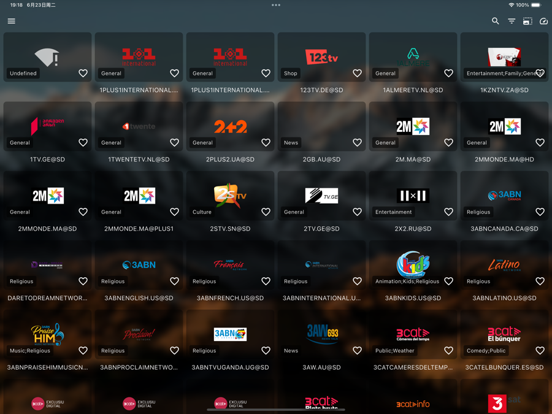
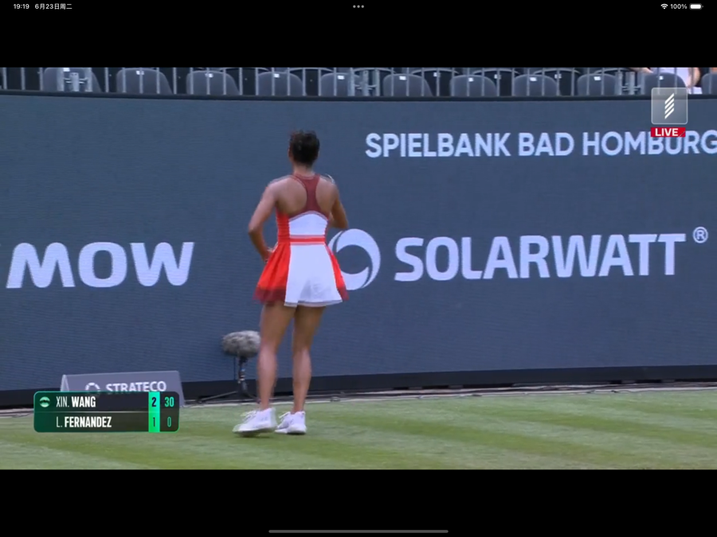
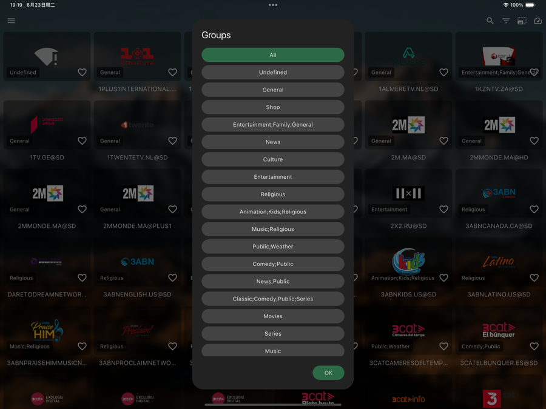
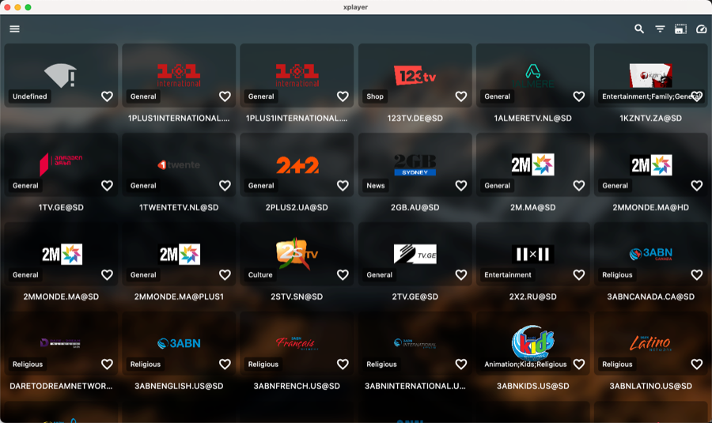
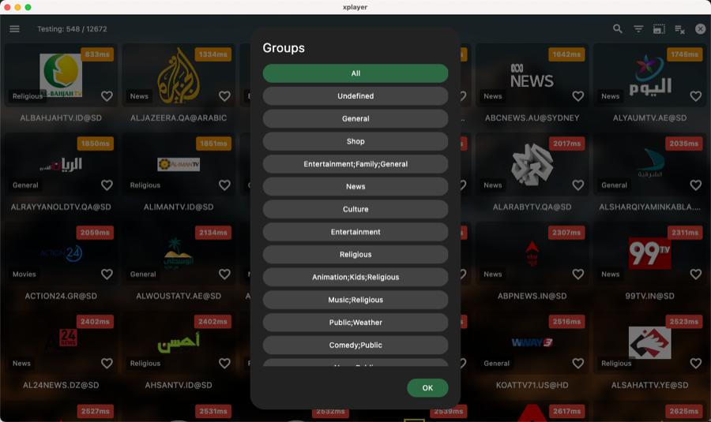

**English** | [中文](README.md)

<h1 align="center">XPlayer</h1>

<p align="center">A cross-platform IPTV / M3U player · Android (phone/tablet/TV) · iOS / iPad · macOS · Windows · Linux</p>

<p align="center">Works out of the box with built-in <a href="https://github.com/iptv-org/iptv">iptv-org</a> public playlists, with <b>channel grouping &amp; search</b>, EPG, favorites, and <b>phone-to-TV remote text input</b>.</p>

<p align="center">
  <a href="https://github.com/TNT-Likely/xplayer/releases/latest"></a>
  <a href="https://github.com/TNT-Likely/xplayer/releases"></a>
  <a href="https://apps.apple.com/app/id6783271337"></a>
  <a href="https://testflight.apple.com/join/BD5BMpqe"></a>
  <a href="https://github.com/TNT-Likely/xplayer/stargazers"></a>
  <a href="https://github.com/TNT-Likely/xplayer/actions/workflows/release.yml"></a>
  <a href="LICENSE"></a>
</p>

---

## ✨ Features

- 📺 **Built-in channels, zero setup** — ships with [iptv-org](https://github.com/iptv-org/iptv) public playlists; auto-loads China on first launch, plus one-tap presets for All / HK / TW / SG / US / UK / JP / KR + Sports / News / Movies. You can also import any M3U/M3U8 (local file or URL).
- 🖼️ **Sharper picture on TV** — a built-in native player engine on Android renders to the TV's hardware video plane (SurfaceView), tapping into the TV's VPP / upscaling for a noticeably crisper image than plain texture rendering; switch back anytime in settings.
- 🔊 **Fixes "video but no sound"** — bundled FFmpeg audio decoding adds AC-3 / E-AC-3 / DTS / MP2 and other codecs many devices can't decode in hardware.
- 🎚️ **Quality selection** — pick the resolution (1080P/720P/…) for multi-bitrate streams.
- 🎧 **Audio track switching** — switch tracks on multi-language/multi-track channels.
- 🔎 **Grouping + Search** — filter instantly by name from the search bar, plus one-tap group chips (News / Sports / Movies…).
- 🗓️ **EPG** — XMLTV programme guide support.
- ⭐ **Favorites + 🕘 Recently played** — quick rows on the home screen (recently-played spans playlists).
- 😴 **Sleep timer** — auto-stop playback after a set time.
- 🔁 **LAN config sync** — pull playlists / proxy / favorites / settings from another device on the same Wi-Fi, with a per-item preview before applying.
- 📊 **Playback info panel** — real-time diagnostics: resolution / codec / bitrate / frame rate / buffer / dropped frames / decoder.
- 🖥️ **Every platform** — Android (phone/tablet), Android TV, iOS / iPad, macOS, Windows, Linux from one codebase.
- 📱 **Phone → TV remote input** — your phone auto-discovers the TV on the LAN and types remotely with real-time sync (delete key included).
- 🌐 **Localized** — English / 中文.

## 📸 Preview

<p align="center">
  
  
  
  <br/>
  
  
</p>

<details>
<summary><b>📱 iPad / 🖥️ macOS screenshots</b></summary>

<p align="center">
  
  
  <br/>
  
  
  <br/>
  
  
</p>

</details>

<details>
<summary><b>🚀 Install</b></summary>

**iOS / iPad / macOS** are on the [App Store](https://apps.apple.com/app/id6783271337) (currently available outside mainland China only — a mainland China listing needs an ICP filing whose quota is used up; you can help cover the filing and server costs by [donating](#-donate)). For other platforms, grab a build from [Releases](https://github.com/TNT-Likely/xplayer/releases):

- **Android / Android TV / tablet** (split per ABI for smaller size):
  - `xplayer-<version>-arm64-v8a.apk` — most phones / tablets / TV boxes (**recommended**)
  - `xplayer-<version>-armeabi-v7a.apk` — older 32-bit devices
  - `xplayer-<version>-x86_64.apk` — emulators / x86 devices
  - `xplayer-<version>-universal.apk` — fallback if you're unsure
- **Windows**: `xplayer-windows-x64.zip`
- **macOS**: [Download on the App Store](https://apps.apple.com/app/id6783271337) (recommended); or `xplayer-macos.dmg` (see FAQ for first launch)
- **Linux**: `xplayer-linux-x64.tar.gz`
- **iOS / iPad**: [Download on the App Store](https://apps.apple.com/app/id6783271337) (recommended); or the [TestFlight beta](https://testflight.apple.com/join/BD5BMpqe) / the unsigned ipa in Releases

</details>

<details>
<summary><b>🕹️ Usage</b></summary>

1. Open the app — it auto-loads the built-in iptv-org China playlist on first run.
2. Use the search bar / group chips to find channels fast, and ⭐ favorite the ones you watch; the drawer's **Recommended Sources** adds more presets or imports your own M3U; **manage / edit / delete sources on the "Playlist" page**.
3. On a TV, open **Remote Input** on your phone to discover the TV and type remotely.

</details>

<details>
<summary><b>🛠️ Development / Build</b></summary>

```sh
flutter pub get
flutter run -d <device_id>

# Build
flutter build apk --release -PabiSplit   # Android: split APKs per ABI
flutter build appbundle --release        # Android: AAB for Play (no split)
flutter build ios --release              # iOS / iPad
flutter build macos --release            # macOS
flutter build windows --release          # Windows
flutter build linux --release            # Linux
```

> Release signing: copy `android/key.properties.sample` to `android/key.properties` and fill in your keystore; CI injects it via GitHub Secrets — see `.github/workflows/release.yml`.
>
> On a CN network, if `flutter pub get` / Gradle stalls: use `flutter pub get --offline` + `flutter run --no-pub`, or set `PUB_HOSTED_URL` / `FLUTTER_STORAGE_BASE_URL` mirrors (the repo's `.vscode/launch.json` already handles this).

</details>

## ⚖️ Disclaimer

XPlayer is a **player**. It does not host or provide any stream. The built-in presets come from the open-source [iptv-org/iptv](https://github.com/iptv-org/iptv) project — publicly aggregated, publicly accessible stream URLs that the app fetches from upstream at runtime (no bundled copy). Please use it for personal, lawful purposes only; report any infringing link upstream to iptv-org for removal.

<details>
<summary>❓ FAQ</summary>

**How to open the unsigned app on macOS?** On first launch, if you see "cannot verify developer", right-click XPlayer.app > Open, or allow it in System Settings > Privacy & Security; or run `sudo xattr -rd com.apple.quarantine XPlayer.app`.

**Remote input can't find the TV?** Make sure the phone and TV are on the same LAN; your router must support mDNS/Bonjour; try restarting the app.

</details>

## 💝 Donate

If you find this project useful, buy the developer a coffee ☕

[](https://paypal.me/sunxiaoyes)

| Alipay | WeChat Pay | Binance |
|:---:|:---:|:---:|
|  |  |  |

## 📄 License

Released under the [MIT](LICENSE) license. Built-in playlists come from the open-source [iptv-org/iptv](https://github.com/iptv-org/iptv) project (The Unlicense).
